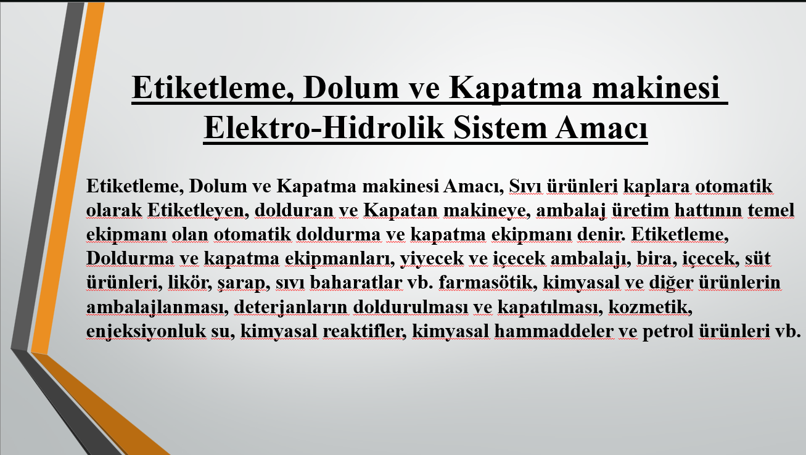
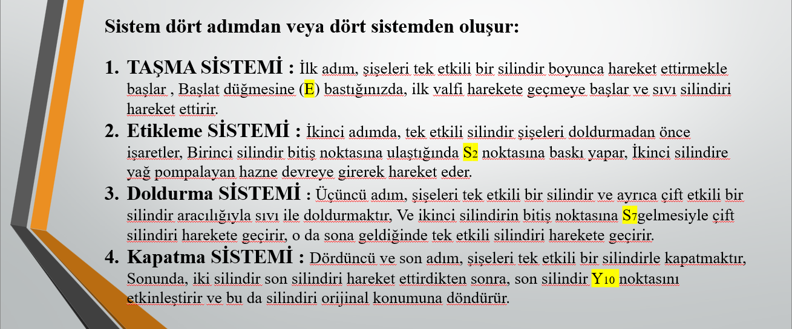
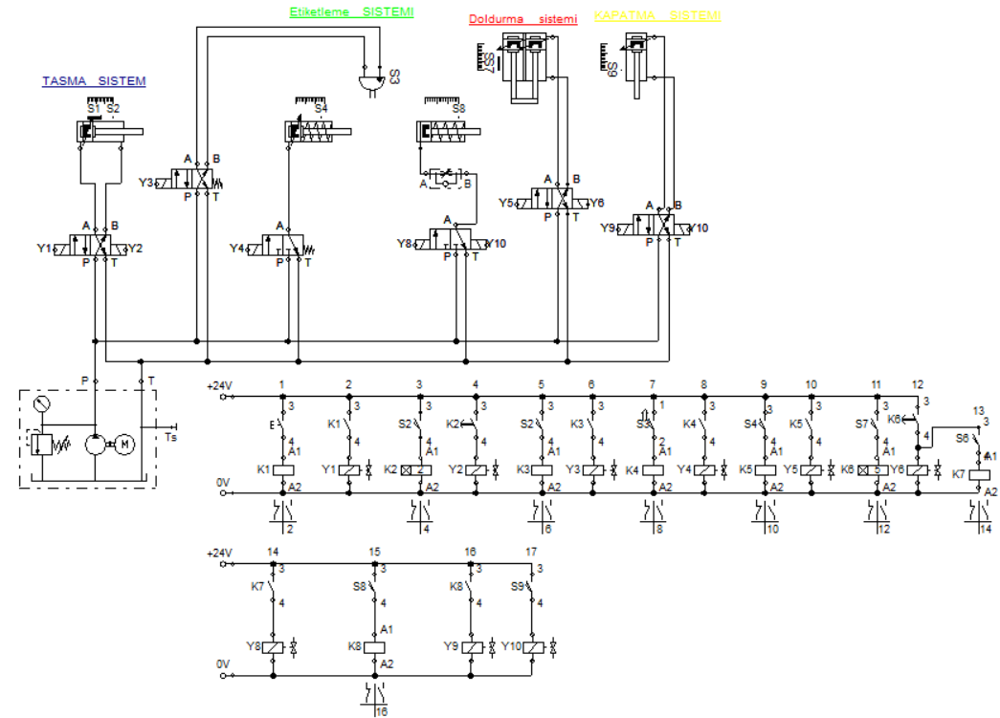
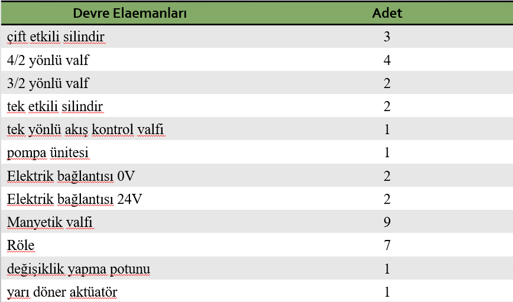
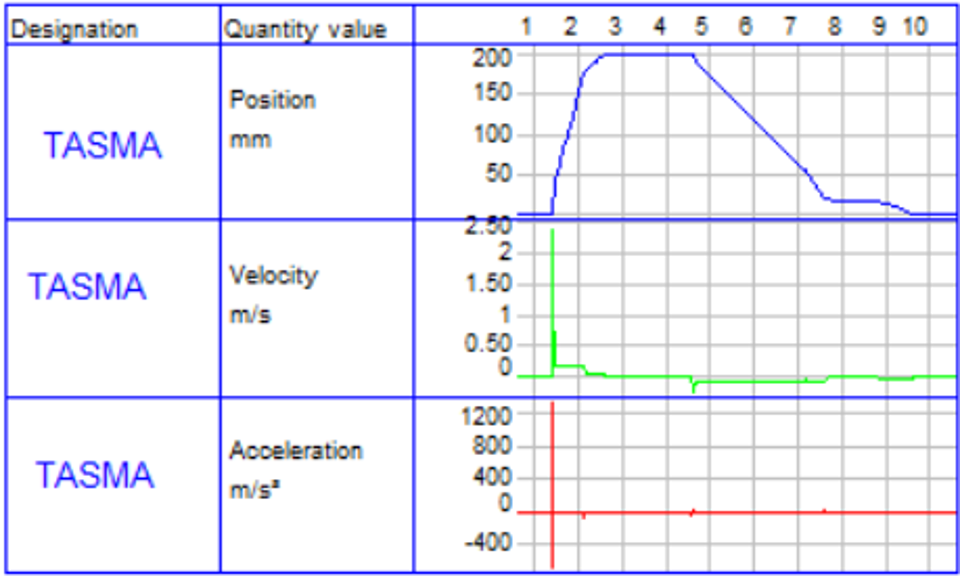
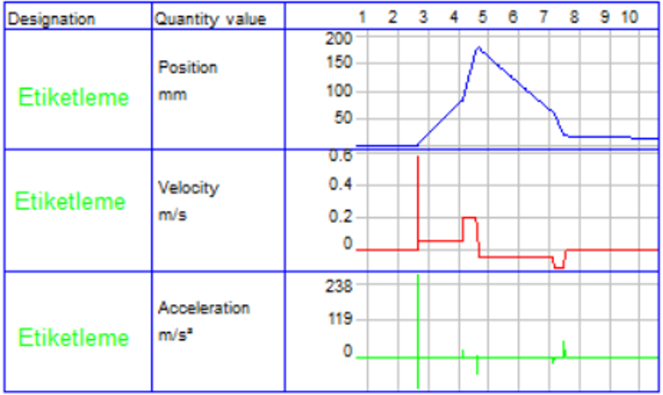
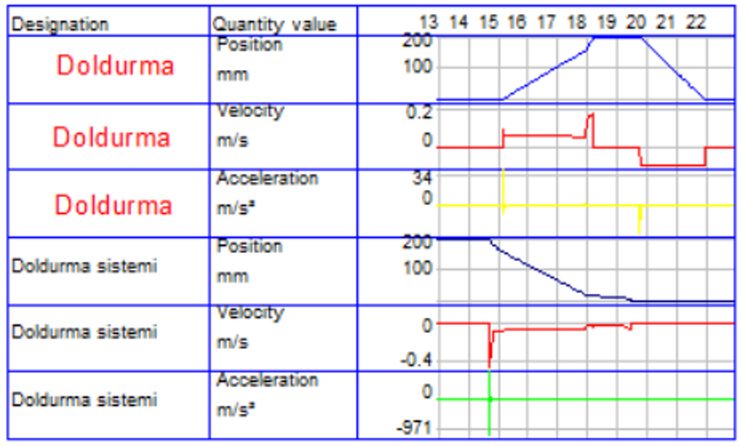
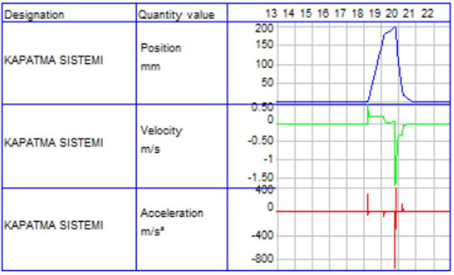
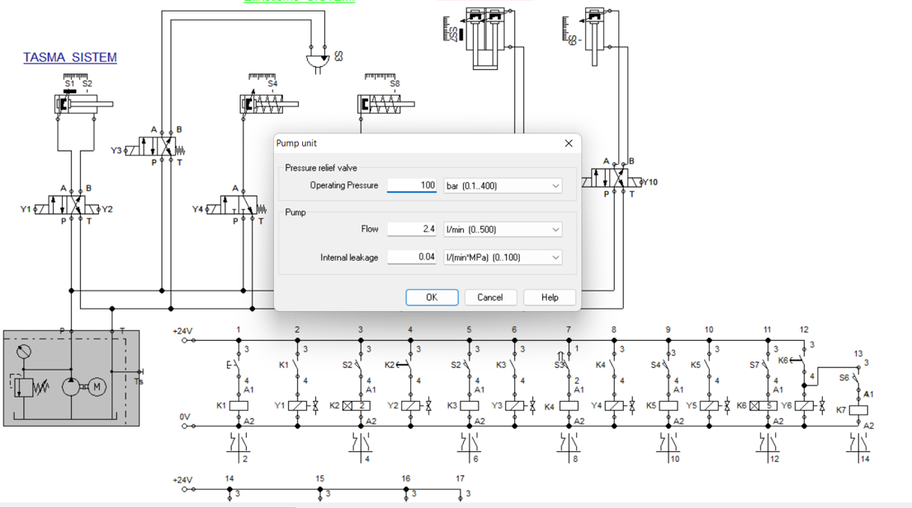
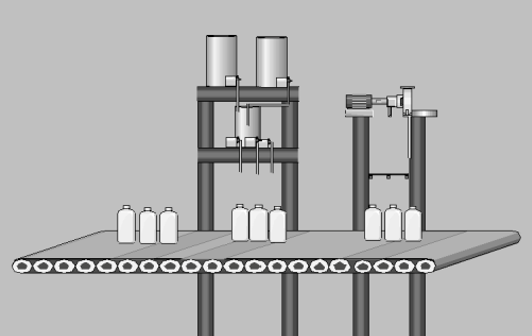

# Electro-Hydraulic Labeling, Filling & Capping Machine

## 1. Project Overview

This project presents the design and simulation of an electro-hydraulic automation system for a packaging machine. The machine is designed to perform four main operations: bottle transfer, labeling, filling, and capping.

The project focuses on the design of the hydraulic and electrical control circuit, actuator sequencing, valve operation, relay control, pressure setting, and motion behavior analysis using position, velocity, and acceleration graphs.

## 2. Engineering Problem

Packaging machines require accurate and synchronized motion between multiple actuators to complete sequential operations such as transferring bottles, applying labels, filling liquid, and closing caps.

The engineering problem in this project was to design an electro-hydraulic control system capable of coordinating multiple cylinders and valves in a correct operating sequence while maintaining safe and controlled machine motion.

The project aimed to answer the following engineering questions:

* How can hydraulic actuators be sequenced to perform packaging operations?
* How can electrical control elements such as relays and solenoid valves control hydraulic motion?
* How can single-acting and double-acting cylinders be integrated into one system?
* How can the filling stage be controlled using a timed stop?
* How can motion behavior be evaluated using position, velocity, and acceleration graphs?

## 3. My Role in the Project

In this project, I worked on the design, simulation, and analysis of the electro-hydraulic system. My responsibilities included:

* Defining the operating sequence of the packaging machine
* Dividing the machine operation into transfer, labeling, filling, and capping systems
* Designing the hydraulic circuit using cylinders, valves, and pump unit
* Designing the electrical control circuit using relays, solenoid valves, and limit switches
* Integrating single-acting and double-acting cylinders into the control sequence
* Setting the operating pressure and pump flow rate
* Simulating the system behavior using electro-hydraulic simulation software
* Analyzing position, velocity, and acceleration graphs for each operating stage
* Evaluating the system performance and motion response

## 4. Tools & Software Used

* FluidSIM
* Electro-hydraulic simulation software
* Hydraulic circuit design
* Electrical control circuit design
* Motion analysis
* Position, velocity, and acceleration graph evaluation

## 5. Step-by-Step Project Workflow

### Step 1: Understanding the Packaging Machine Function

The project started by defining the purpose of the machine. The system is designed to automate a packaging process for liquid products by performing bottle transfer, labeling, filling, and capping operations.

This type of system can be used in packaging lines for food, beverages, cosmetics, pharmaceutical liquids, chemical products, detergents, and similar liquid products.

### Step 2: Dividing the Machine into Four Operating Systems

The machine workflow was divided into four sequential systems:

1. **Transfer System**
   Moves the bottles along the production line.

2. **Labeling System**
   Applies labels or marks the bottles before filling.

3. **Filling System**
   Fills the bottles using hydraulic actuator motion.

4. **Capping System**
   Closes the bottles after the filling process.

### Step 3: Designing the Electro-Hydraulic Circuit

The hydraulic and electrical circuit was designed to control the complete machine sequence. The circuit includes hydraulic actuators, directional control valves, solenoid valves, relays, electrical connections, and a pump unit.

The circuit was designed to ensure that each actuator operates in the correct order according to the machine cycle.

### Step 4: Selecting and Organizing System Components

The electro-hydraulic system was built using several hydraulic and electrical components, including:

* 3 double-acting cylinders
* 2 single-acting cylinders
* 4 directional 4/2 valves
* 2 directional 3/2 valves
* 1 one-way flow control valve
* 1 pump unit
* 9 solenoid valves
* 7 relays
* 1 semi-rotary actuator
* 24V and 0V electrical connections

### Step 5: Transfer System Motion Analysis

The transfer system motion was analyzed using position, velocity, and acceleration graphs. This helped evaluate how the bottle transfer actuator moves during the operating cycle.

### Step 6: Labeling System Motion Analysis

The labeling system was analyzed using motion graphs to evaluate the behavior of the single-acting cylinder responsible for the labeling operation.

### Step 7: Filling System Motion Analysis

The filling system was analyzed using both single-acting and double-acting cylinder motion graphs. This stage is important because it controls the filling operation.

A timed filling sequence was implemented where the double-acting filling cylinder stops for **5 seconds** at the S7 position to allow the bottles to be filled properly.

### Step 8: Capping System Motion Analysis

The capping system was analyzed using position, velocity, and acceleration graphs. This stage completes the packaging cycle by closing the bottles using actuator motion.

### Step 9: Pressure and Pump Flow Setting

The hydraulic system operating pressure and pump flow rate were defined in the simulation.

The main operating settings included:

* **Operating pressure:** 100 bar
* **Pump flow rate:** 2.4 L/min
* **Internal leakage:** 0.04 L/(min·MPa)

### Step 10: Machine Concept and Final System Review

The final system concept represents an automated packaging machine capable of performing the required operations in sequence. The system combines hydraulic motion, electrical control, actuator timing, and process automation.

## 6. Engineering Analysis Performed

The project included the following engineering and simulation tasks:

* Electro-hydraulic circuit design
* Electrical control circuit design
* Hydraulic actuator sequencing
* Solenoid valve control
* Relay-based control logic
* Single-acting cylinder integration
* Double-acting cylinder integration
* Pump pressure and flow configuration
* Timed filling sequence design
* Position graph analysis
* Velocity graph analysis
* Acceleration graph analysis
* Packaging process automation

## 7. Key System Settings and Results

* **Machine operations:** Transfer, labeling, filling, and capping
* **Double-acting cylinders:** 3
* **Single-acting cylinders:** 2
* **Directional 4/2 valves:** 4
* **Directional 3/2 valves:** 2
* **Solenoid valves:** 9
* **Relays:** 7
* **Pump unit:** 1
* **Operating pressure:** 100 bar
* **Pump flow rate:** 2.4 L/min
* **Timed filling stop:** 5 seconds at S7 position
* **Analysis outputs:** Position, velocity, and acceleration graphs

## 8. Project Images and Explanation

### Project Overview

This image explains the purpose of the electro-hydraulic packaging machine and its industrial application.

### Working Principle

This image shows the four main stages of the machine operation: transfer, labeling, filling, and capping.

### Circuit Diagram

This image shows the complete electro-hydraulic and electrical control circuit used to operate the machine.

### System Components

This image shows the main hydraulic and electrical components used in the system.

### Transfer Motion Graph

This image shows the position, velocity, and acceleration response of the transfer system.

### Labeling Motion Graph

This image shows the motion behavior of the labeling system.

### Filling Motion Graph

This image shows the motion behavior of the filling system, including the actuator response during the filling process.

### Capping Motion Graph

This image shows the motion behavior of the capping system.

### Pressure Setting

This image shows the hydraulic pressure and pump flow rate settings used in the simulation.

### Machine Concept

This image shows the general concept of the packaging machine and its mechanical layout.

## 9. Skills Demonstrated

This project demonstrates the following engineering skills:

* Electro-hydraulic system design
* Hydraulic circuit design
* Electrical control circuit design
* FluidSIM simulation
* Packaging machine automation
* Actuator sequencing
* Single-acting and double-acting cylinder control
* Directional control valve application
* Solenoid valve control
* Relay-based control logic
* Pump pressure and flow setting
* Motion analysis
* Position, velocity, and acceleration graph interpretation
* Industrial automation thinking
* Technical documentation

## 10. Project Files

The full project report is available in the `report/` folder:

[View Full Project Report](report/Electro-Hydraulic-Packaging-Machine.pdf)

## 11. Conclusion

This project helped me understand the design and simulation of electro-hydraulic automation systems used in industrial packaging machines.

Through this project, I practiced hydraulic circuit design, electrical control logic, actuator sequencing, pressure setting, pump flow configuration, and motion analysis using position, velocity, and acceleration graphs.

The final system demonstrates how hydraulic and electrical components can work together to automate bottle transfer, labeling, filling, and capping operations in a packaging production line.

## Author

Mohamed Osman
Mechanical Engineering
